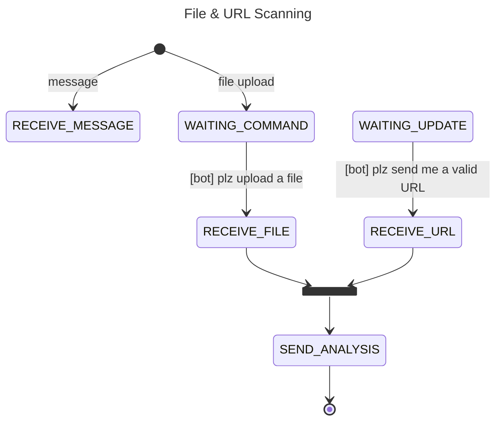

# AI Security Assistant

A Chatbot-utilizing-LLM to assist general user in digital security area.

Core Features :

- [x] File Scanning
- [x] URL Scanning
- [x] Security News and Updates
- [ ] Graphical cybersecurity information
- [ ] Interactive Quiz
- [ ] General Security Tips

## How it Works

### References

- [VirusTotal](https://www.virustotal.com/)
- [PhishStats](https://phishstats.info/)
